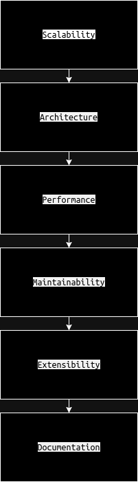

# PlanetsApp

This project is a Single Page Application (SPA) that displays information about Star Wars planets. It utilizes React, React Router, GraphQL, and React Testing Library, following individual design.

;

### Setup

1. Clone the repository:

   ```bash
   git clone git@github.com:turbolukoshko/planets-app.git
   ```

   or

   ```bash
   gh repo clone turbolukoshko/planets-app
   ```

2. Navigate to the project directory:

   ```bash
   cd planets-app
   ```

3. Install dependencies:

This project requires NodeJS (version 18 or later) and NPM

   ```bash
   npm install
   ```

### Usage 

#### CLI Commands
 
#### Starting the app
   ```bash
   npm run dev
   ```
#### Running the unit tests
   ```bash
   npm run test
   ```

### Basic questions:

#### a. Architecture ####

This project follows a component-based architecture using React.js, with a focus on modularity and reusability. Here's a breakdown of the architecture and how components interact with each other:

- **Component-Based Approach**: The application is structured around reusable, self-contained components, each responsible for a specific UI element or feature.
- **App Component**: Serves as the root component of the application. It sets up the routing using _React Router_ and renders different components based on the URL.
- **Router**: Utilizes _React Router_ for client-side routing. Defines routes for different parts of the application, such as _/planets_, _/favorites_, and _/planets/:planetId_.
- **Sidebar Component**: Provides navigation links for easy access to _/planets_ and _/favorites_. Remains persistent across different routes.
- **Planets Component**: Displays a table of planets fetched from the GraphQL API. Utilizes _Apollo Client_ for GraphQL data fetching. Allows sorting of planets by diameter and population, mark/unmark a planet as a favorite. Clicking on a planet row redirects to the _/planets/:planetId_ route for detailed information.
- **Planet Component**: Renders detailed information about a selected planet.
- **Favorites Component**: Displays a list of favorite planets stored in _local storage_. Renders each favorite planet using a card format. Provides functionality to remove a planet from favorites, with a modal confirmation dialog.
- **404 Page Component**: The application includes a custom 404 page to handle routes that do not match any defined paths.
- **Error Boundary**: An error boundary component is implemented to catch and handle errors that occur during rendering or lifecycle methods of its children components.
- **Local Storage**: Stores favorite planets locally in the browser. Ensures persistence of favorites across sessions.
- **GraphQL Integration**: The PlanetsContainer utilizes _Apollo Client_ to fetch data from the _GraphQL_ API.
- **Utility Function**: The Planets Component also utilizes a utility function _parseFavoritePlanets_ to retrieve favorite planets from local storage.
- **Unit Tests with React Testing Library**: Unit tests ensure the reliability and correctness of components.
- **SVG Shared Components**: Shared SVG components can be used for consistent visual elements across the application.
- **Styled Components**: Styled-components are used for styling the application.

#### b. Technical decision ####

- **React Router for Routing**: React Router simplifies client-side routing with its declarative approach, enabling the creation of a seamless single-page application experience without full page reloads. Its robustness and simplicity make it an ideal choice for managing navigation within a React application.
- **Apollo Client for GraphQL Integration**: Apollo Client enhances data fetching with GraphQL by reducing overfetching, enabling multiple resource retrieval in a single query, and providing strong typing for clearer documentation and easier development. These advantages make it a superior choice over traditional REST APIs for managing complex data requirements efficiently.
- **Local Storage**: Local storage offers simplicity and broad compatibility for persisting favorite planets locally in the browser, ensuring a seamless and personalized user experience. While IndexedDB provides more advanced features, local storage suffices for the relatively small amount of data in this application, and session storage is less suitable for persisting data across sessions.
- **Styled-components**: Styled-components promote better organization and maintainability by encapsulating styles within components. They enable the creation of highly customizable and reusable components with dynamic styles based on props, while streamlining the styling process and facilitating the creation of responsive and themeable UIs through _CSS-in-JS_.
- **React Testing Library**: React Testing Library was chosen for its focus on testing user behavior, resulting in more maintainable tests compared to testing implementation details. Its lightweight nature and intuitive API make it easy to learn and use effectively, ensuring reliable and robust unit tests for React components.

#### c. Work sequence ####

- Analyzed project requirements and specifications.
- Reviewed provided _GraphQL schema_ and _API documentation_.
- Set up the development environment, including installing necessary dependencies such as _React_, _Apollo Client_, and _styled-components_.
- Created folder structure.
- Implemented routing using React Router to define routes for different views/pages.
- Integrated _Apollo Client_ for _GraphQL_ data fetching and management.
- Developed the markup for components to display planets data and related subcomponents.
- Implemented functionality for marking/unmarking planets as favorites and persisting favorite planets data in local storage.
- Styled components using styled-components library for UI.
- Implemented unit tests using _react-testing-library_ to ensure the reliability and correctness of components.
- Documented technical decisions, project structure, and usage instructions in the _README.md_ file.

#### d. Testing ####

**Unit Testing**

- Write unit tests for individual components using React Testing Library.
- Test component rendering, user interactions, state changes, and prop validations.
- Cover edge cases and error scenarios to ensure robustness.
- Mock external dependencies.

#### e. Alternatives ####

- **Different State Management Libraries**: Instead of using React's built-in state management, alternatives such as _Redux_, _MobX_, _Zustand_ or _Recoil_ could have been considered for managing application state, especially if the application's state grows in complexity or needs to be shared across multiple components.
- **Alternative Styling Approaches**: While styled-components was chosen for styling components in this project, other styling approaches such as _CSS Modules_, _CSS-in-JS_ libraries like Emotion, or traditional _CSS_ with preprocessors like _Sass_ could have been used depending on personal preference or project requirements.
- **Testing Frameworks**: Although _React Testing Library_ was chosen for unit testing components, other testing frameworks like _Jest + Enzyme_ or _Cypress_ for end-to-end testing could have been considered. Each testing framework has its own strengths and may be better suited for specific testing needs or preferences.
- **REST Client Libraries**: While _Apollo Client_ was chosen for _GraphQL_ integration, other _REST_ client libraries such as _Axios_, _Fetch API_, _React Query_ could have been considered for interacting with _RESTful APIs_.
- **Alternative Routing Solutions** : Although _React Router_ was chosen for client-side routing, alternative routing solutions such as _Next.js_ could have been evaluated based on features like code splitting, prefetching, or server-side rendering capabilities.
- **Data Persistence Options**: While _local storage_ was chosen for persisting favorite planets, alternatives such as _IndexedDB_, _session storage_, or _server-side databases_ could have been considered depending on factors such as data size, persistence requirements, or scalability.

#### f. How would you have improved your work? ####

- **Enhanced Testing**: Expanding test coverage, including edge cases and integration tests, and setting up end-to-end testing for a comprehensive testing suite.
- **Performance Optimization**: Identifying and addressing performance bottlenecks, optimizing data fetching, and improving rendering times for a smoother user experience using tools like _Lighthouse_.
- **Accessibility Improvements**: Conducting an accessibility audit and implementing enhancements to ensure inclusivity for all users.
- **User Interface Enhancements**: Refining the user interface based on feedback, focusing on usability, consistency, and responsiveness. Implementing media queries to ensure the application's layout and styling adapt seamlessly across different devices and screen sizes, enhancing the overall user experience.
- **Error Handling and Logging**: Implementing robust error handling mechanisms and setting up logging for faster issue resolution.
- **Documentation**: Customize Storybook to document and demonstrate UI components, providing better visualization, testing, and collaboration during development.

#### g. Scale in the future (diagrams, schemes): ####

- **Architecture**: The chosen architecture, which includes modular components and clear separation of concerns, lays a strong foundation for scalability.
- **Performance**: By implementing efficient data fetching strategies, caching mechanisms, and optimizing critical paths, the application can handle increased traffic and data volume effectively. Load balancing, horizontal scaling, and asynchronous processing can further enhance performance under heavy loads.
- **Maintainability**: The clean code practices, modular design, and thorough documentation contribute to the maintainability of the application over time.
- **Extensibility**: The application's architecture and design patterns prioritize extensibility, allowing for the seamless integration of new features and technologies as requirements evolve.
- **Documentation**: Comprehensive documentation, including architectural diagrams, README files, and inline comments.

This diagram illustrates how the architecture, performance optimizations, maintainability practices, extensibility, and documentation contribute to the scalability of the project. As the project grows and evolves, these factors ensure that the application can scale effectively to meet future demands while maintaining performance, reliability, and maintainability.



#### h. Feedback ####

- Additional Design Options for Media Queries
- More States for Buttons and Tabs
